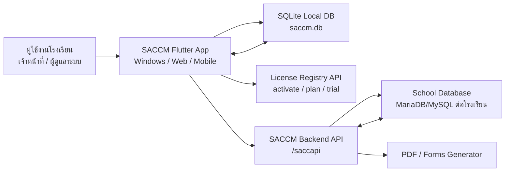
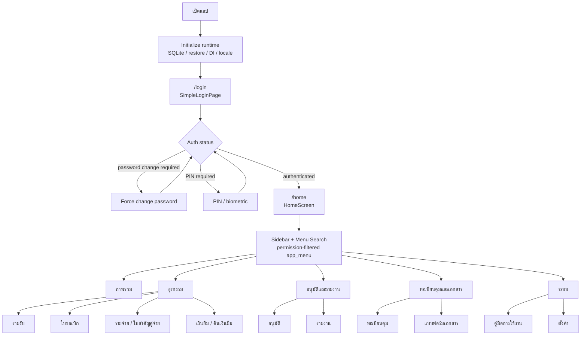
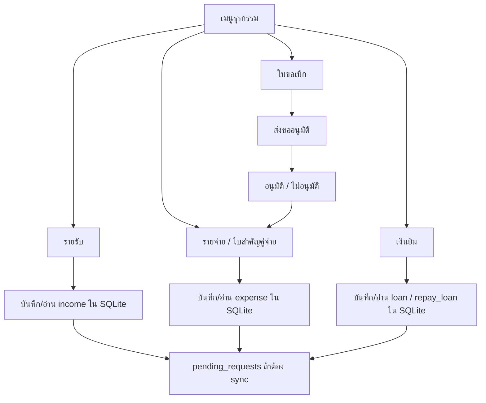
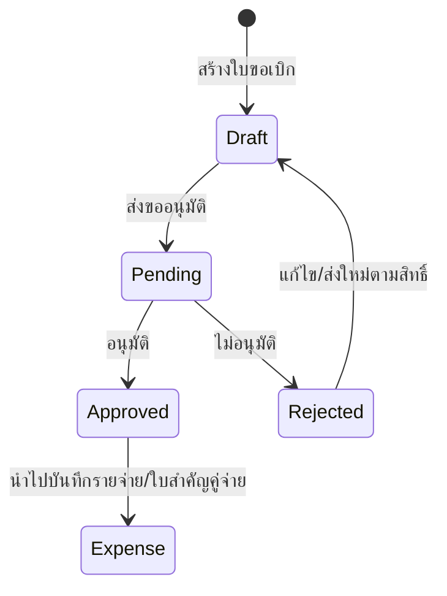
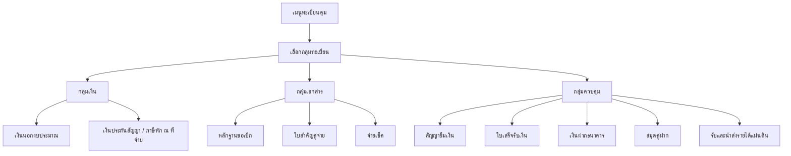
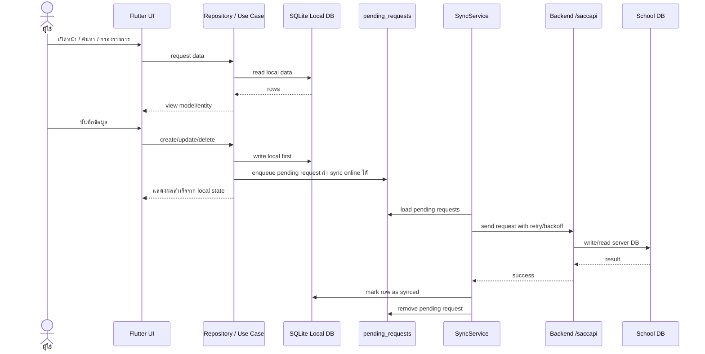
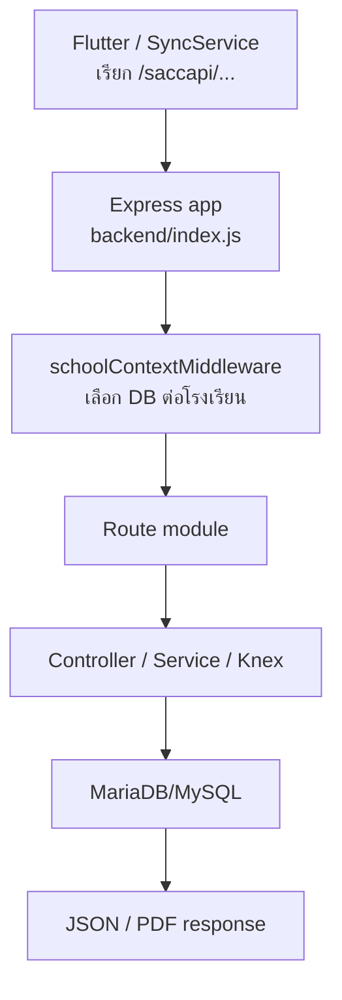

# App Flow L0/L1

> เอกสารนี้สรุป flow ของแอป SACCM ระดับ L0 และ L1 จากโครงสร้างปัจจุบันของ Flutter app, SQLite local database, sync service และ backend API
>
> วันที่จัดทำ: 2026-05-25

## ขอบเขต

- ครอบคลุม flow หลักของผู้ใช้ในแอป Flutter (`forntend/`) ตั้งแต่เปิดแอป, login, home shell, เมนูหลัก, ธุรกรรม, ทะเบียนคุม, รายงาน, แบบฟอร์ม และตั้งค่า
- ครอบคลุม data flow ระดับสูงแบบ local-first: อ่าน/เขียน SQLite ก่อน แล้วค่อย sync ไป backend เมื่อ license และ network อนุญาต
- ไม่ลงรายละเอียด field-level, validation รายฟอร์ม, wireframe UI หรือ implementation ของแต่ละ endpoint

## L0: System Context Flow

L0 คือภาพรวมความสัมพันธ์ของผู้ใช้กับระบบ SACCM และระบบภายนอกที่เกี่ยวข้อง

### L0 Flow หลัก

1. ผู้ใช้เปิดแอป SACCM
2. แอปเตรียม local runtime: SQLite FFI/Web DB, pending restore, service locator, locale ไทย และ provider หลัก
3. แอปเริ่มที่ `/login`
4. ผู้ใช้ login ด้วยบัญชี local/online ตาม license และ session ที่มี
5. เมื่อผ่าน auth แล้วเข้าสู่ `/home`
6. ผู้ใช้ทำงานผ่านเมนูหลัก เช่น รายรับ, ใบขอเบิก, รายจ่าย, เงินยืม, อนุมัติ, ทะเบียนคุม, รายงาน, แบบฟอร์ม, ตั้งค่า
7. แอปอ่านข้อมูลธุรกิจจาก SQLite เป็นหลัก
8. เมื่อมีการเขียนข้อมูล แอปบันทึก local ก่อน และ enqueue pending request สำหรับ sync
9. ถ้า license เป็น online+offline และ network พร้อม `SyncService` จะส่ง pending request ไป backend
10. Backend รับ API ภายใต้ `/saccapi`, เลือก database ต่อโรงเรียนผ่าน school context แล้วเขียน/อ่าน MariaDB/MySQL

### L0 Component Responsibilities

| Component | หน้าที่หลัก | ไฟล์อ้างอิง |
|---|---|---|
| Flutter App | UI, auth session, navigation, local-first read/write, offline mode | `forntend/lib/main.dart` |
| SQLite Local DB | source of truth ฝั่งแอป runtime, seed master, migration, pending queue | `forntend/lib/core/local_data_source/app_database.dart` |
| Service Locator | ประกอบ datasource, repository, sync service และ service shared | `forntend/lib/core/di/service_locator.dart` |
| Sync Service | enqueue, retry/backoff, sync pending requests เมื่อออนไลน์ | `forntend/lib/core/services/sync_service.dart` |
| Backend API | Express routes สำหรับ auth, master, transaction, register, reports, forms | `backend/index.js` |
| School Context | เลือก database ต่อโรงเรียนจาก JWT/schoolCode | `backend/src/middleware/school-context.middleware.js` |
| License Registry | activation, product plan, trial/license mode | `forntend/lib/config.dart` |

## L1: Application Flow

L1 แตก flow ภายในแอปเป็นชั้น navigation, module และ data movement ที่ทีมใช้ดูเวลาเพิ่มหรือแก้ feature

### 1. App Startup และ Auth

Entry point ของแอปอยู่ที่ `forntend/lib/main.dart`

Flow:

1. `main()` เรียก `WidgetsFlutterBinding.ensureInitialized()`
2. ตั้งค่า desktop window และ SQLite factory ตาม platform
3. เริ่ม embedded trial license และ apply pending DB restore ก่อนเปิด database ผ่าน DI
4. `ServiceLocator.instance.init()` ลงทะเบียน datasource, repository, service และ sync worker
5. `MaterialApp` ใช้ `LicenseGate` และ `SessionRefreshListener`
6. route เริ่มต้นคือ `/login`
7. `/login` ใช้ `SimpleLoginPage` และ `SimpleAuthProvider`
8. เมื่อ authenticated และไม่มี forced password/PIN setup ค้างอยู่ จะ `pushReplacementNamed('/home')`

Routes หลัก:

| Route | Page | บทบาท |
|---|---|---|
| `/login` | `SimpleLoginPage` | login, PIN, biometric, forced password change |
| `/activate` | `LicenseActivationPage` | activate license |
| `/product-plan` | `ProductPlanPage` | เลือก/ดู package |
| `/home` | `HomeScreen` | shell หลักหลัง login |

### 2. Home Shell และ Navigation

`HomeScreen` ใน `forntend/lib/features/home/presentation/pages/home_page.dart` เป็น shell หลักของแอปหลัง login

Flow:

1. โหลดเมนูจาก `MenuService.loadMenuSnapshot()`
2. โหลด preference เช่น sidebar collapsed และเมนูที่เปิดล่าสุด
3. กรองเมนูด้วย permission จาก `SimpleAuthProvider.can(...)`
4. แสดง sidebar/menu search ตาม section ที่ผู้ใช้มีสิทธิ์
5. เมื่อผู้ใช้เปลี่ยนเมนู ระบบเช็ก active form ผ่าน `SingleOpenNavigation`
6. ถ้ามีฟอร์มค้าง จะถามยืนยันก่อนออกจากหน้า
7. เปลี่ยน `_selectedIndex` แล้วสร้าง nested content navigator ใหม่
8. `HomeRouter` map `HomeNavIndex` ไปยัง widget/page ของแต่ละโมดูล

เมนูหลักมาจาก `app_menu` seed ใน `forntend/lib/core/local_data_source/app_menu_seed_data.dart` แล้ว merge กับ fixed nav slot (`หน้าหลัก`, `ตั้งค่า`, `ออกจากระบบ`) ใน `forntend/lib/core/local_data_source/app_menu_local_data_source.dart`

| Section | เมนู | Nav index | Page/Widget |
|---|---|---:|---|
| ภาพรวม | หน้าหลัก | 0 | `HomeDashboard` |
| ธุรกรรม | รายรับ | 1 | `IncomeWidget` |
| ธุรกรรม | ใบขอเบิก | 11 | `ExpenseReqWidget` |
| ธุรกรรม | รายจ่าย / ใบสำคัญคู่จ่าย | 2 | `ExpenseWidget` |
| ธุรกรรม | เงินยืม | 3 | `LoanWidget` |
| อนุมัติและรายงาน | อนุมัติ | 4 | `ApprovalPage` |
| อนุมัติและรายงาน | รายงาน | 5 | `ReportsPage` |
| ทะเบียนคุมและเอกสาร | ทะเบียนคุม | 9 | `RegisterPage` |
| ทะเบียนคุมและเอกสาร | แบบฟอร์มเอกสาร | 10 | `FormsPage` |
| ระบบ | คู่มือการใช้งาน | 7 | `UsageFlowHelperPage` |
| ระบบ | ตั้งค่า | 6 | `SettingTab` |
| ระบบ | ออกจากระบบ | 8 | Logout dialog |

ไฟล์ routing หลัก: `forntend/lib/features/home/presentation/pages/home_router.dart`

### 3. Transaction Flow

หลักการร่วม:

- หน้าธุรกรรมอ่าน local repository/datasource เป็นหลัก
- การบันทึกธุรกรรมเขียน SQLite ก่อน เพื่อรองรับ offline และลดการรอ network
- ถ้าเป็นเครื่องที่ sync online ได้ จะสร้าง pending request เพื่อส่ง backend ภายหลัง
- รายการสำคัญที่ sync สำเร็จจะถูก mark เป็น synced ผ่าน callback ใน `ServiceLocator`

โมดูลสำคัญ:

| Flow | ไฟล์/โฟลเดอร์หลัก |
|---|---|
| รายรับ | `forntend/lib/features/income/` |
| รายจ่าย | `forntend/lib/features/expense/` |
| ใบขอเบิก | `forntend/lib/features/expense_req/` |
| อนุมัติ | `forntend/lib/features/approval/` |
| เงินยืม / คืนเงินยืม | `forntend/lib/features/home/presentation/widgets/feature_widgets.dart`, `forntend/lib/core/local_data_source/loan_local_data_source.dart` |

### 4. Approval Flow

Approval เป็น flow กลางของใบขอเบิกก่อนกลายเป็นงานจ่ายเงินจริง

ไฟล์หลัก:

- `forntend/lib/features/expense_req/`
- `forntend/lib/features/approval/presentation/pages/approval_page.dart`
- `forntend/lib/core/local_data_source/approval_local_data_source.dart`
- `backend/src/routes/expensereq.route.js`
- `backend/src/routes/approval.route.js`

### 5. Register Flow

ทะเบียนคุมอยู่ที่ `RegisterPage` และใช้ `RegisterTabs` เป็น registry กลางของแท็บทั้งหมด

แท็บทะเบียนคุม 10 ประเภท:

| Index | ทะเบียน | กลุ่ม |
|---:|---|---|
| 0 | เงินนอกงบประมาณ | กลุ่มเงิน |
| 6 | เงินประกันสัญญา / ภาษีหัก ณ ที่จ่าย | กลุ่มเงิน |
| 1 | หลักฐานขอเบิก | กลุ่มเอกสาร |
| 2 | ใบสำคัญคู่จ่าย | กลุ่มเอกสาร |
| 3 | จ่ายเช็ค | กลุ่มเอกสาร |
| 4 | สัญญายืมเงิน | กลุ่มควบคุม |
| 5 | ใบเสร็จรับเงิน | กลุ่มควบคุม |
| 7 | เงินฝากธนาคาร (กระแสรายวัน) | กลุ่มควบคุม |
| 8 | สมุดคู่ฝาก ส่วนราชการผู้เบิก | กลุ่มควบคุม |
| 9 | รับและนำส่งเงินรายได้แผ่นดิน | กลุ่มควบคุม |

ไฟล์หลัก:

- `forntend/lib/features/register/presentation/pages/register_page.dart`
- `forntend/lib/features/register/presentation/widgets/register_tabs.dart`
- `forntend/lib/features/register/data/datasources/register_local_data_source.dart`
- `backend/src/routes/register.route.js`

### 6. Reports Flow

รายงานอยู่ที่ `ReportsPage` และแบ่งด้วย report tab selector

Flow:

1. ผู้ใช้เลือกปีงบประมาณ/วันที่ตามรายงาน
2. หน้า report โหลดข้อมูลจาก `ReportsRepositoryOffline`
3. รายงานที่มีข้อมูล local ใช้ SQLite เป็นแหล่งอ่านหลัก
4. รายงานที่ต้องอิงเอกสารราชการสำคัญ เช่น daily balance, bank reconciliation, annual summary แยกเป็น tab เฉพาะ
5. บางรายงานมี action เพิ่ม เช่น export CSV, ปิดวัน, บันทึกเหตุผลเทียบยอดธนาคาร

แท็บรายงาน:

| Index | รายงาน | กลุ่ม |
|---:|---|---|
| 0 | ภาพรวม | สรุป |
| 1 | รายเดือน | สรุป |
| 5 | รายงานรับ-จ่ายประจำปี | สรุป |
| 2 | แหล่งเงิน | งบประมาณ |
| 3 | งบทดลอง | งบประมาณ |
| 4 | เงินคงเหลือตามแหล่งเงิน | งบประมาณ |
| 6 | รายงานเงินคงเหลือประจำวัน | รายงานทางการ |
| 7 | สรุปเงินสดประจำวัน | รายงานทางการ |
| 8 | งบเทียบยอดเงินฝากธนาคาร | รายงานทางการ |
| 9 | ปิดวัน | ควบคุม |
| 10 | เงินยืมค้างชำระ | ควบคุม |
| 11 | เช็คค้างจ่าย | ควบคุม |

ไฟล์หลัก:

- `forntend/lib/features/reports/presentation/pages/reports_page.dart`
- `forntend/lib/features/reports/presentation/widgets/reports_tab_selector.dart`
- `forntend/lib/features/reports/data/repositories/reports_repository_offline.dart`
- `backend/src/routes/reports.route.js`
- `backend/src/routes/finance_compliance.route.js`

### 7. Settings และ Master Data Flow

Settings เป็นพื้นที่จัดการข้อมูลตั้งต้นและระบบประกอบ เช่น ข้อมูลโรงเรียน, ผู้ใช้, สิทธิ์, เมนู, หมวดรายรับ, แหล่งเงิน, ประเภทรายจ่าย, บัญชีเช็ค, คู่ค้า, ปีงบประมาณ และฐานข้อมูล

Flow โดยรวม:

1. ผู้ดูแลระบบเข้าเมนูตั้งค่า
2. หน้า setting แสดงเฉพาะเมนูที่สิทธิ์อนุญาต
3. การแก้ master data เขียน local ก่อน
4. ถ้าเป็น online+offline package จะ enqueue sync ไป backend
5. master data ที่เกี่ยวกับรายรับ/รายจ่ายต้องสอดคล้องกับกฎ domain ใน `TEAM_RULES.md` และ `.cursor/rules/10-saccm-domain-core.mdc`

ไฟล์หลัก:

- `forntend/lib/features/setting/presentation/pages/main/setting_page.dart`
- `forntend/lib/features/budget_source/`
- `forntend/lib/features/income_type/`
- `forntend/lib/features/expense_type/`
- `forntend/lib/features/user/`
- `forntend/lib/features/party/`

### 8. Forms/PDF Flow

แบบฟอร์มเอกสารอยู่ใน `FormsPage`

Flow:

1. ผู้ใช้เลือกแบบฟอร์มเอกสาร
2. แอปดึงข้อมูลที่เกี่ยวข้องจาก local/feature repository
3. ถ้าต้อง generate PDF ผ่าน backend จะเรียก `/saccapi/forms`
4. เอกสารเลขที่/กลุ่มเอกสารอ้างอิงการตั้งค่าจาก doc group และสิทธิ์ผู้ใช้

ไฟล์หลัก:

- `forntend/lib/features/forms/presentation/pages/forms_page.dart`
- `backend/src/routes/forms.route.js`

## L1: Data Flow แบบ Local-first

กฎสำคัญของ flow นี้:

- UI runtime อ่าน SQLite ก่อนเสมอสำหรับข้อมูลธุรกิจที่ mirror ลง local แล้ว
- Remote/API เป็นปลายทาง backup/sync ไม่ใช่ source of truth สำหรับ read path ปกติในแอป
- `pending_requests` เก็บงาน sync ที่ยังไม่ส่งหรือส่งไม่สำเร็จ
- `SyncService` ทำงานเฉพาะเมื่อ `LicenseMode.canSyncOnline()` และ network พร้อม
- การ retry ใช้ backoff และไม่ลบ queue จนกว่า server จะยอมรับจริง

## Backend API Flow

กลุ่ม route หลัก:

| กลุ่ม | Routes |
|---|---|
| Auth/User | `/saccapi/login`, `/saccapi/users`, `/saccapi/usersgroup` |
| Master data | `/saccapi/prefix`, `/saccapi/docgroup`, `/saccapi/member`, `/saccapi/moneytype`, `/saccapi/moneygroup` |
| ธุรกรรม | `/saccapi/income`, `/saccapi/expense`, `/saccapi/expensereq`, `/saccapi/loan`, `/saccapi/repayloan` |
| ตั้งค่า/งบประมาณ | `/saccapi/budgetsource`, `/saccapi/incometype`, `/saccapi/expensetype`, `/saccapi/fiscal-year-opening` |
| อนุมัติ/ทะเบียน/รายงาน | `/saccapi/approval`, `/saccapi/register`, `/saccapi/reports`, `/saccapi/finance-compliance` |
| Sync/Menu/Forms | `/saccapi/sync`, `/saccapi/menu`, `/saccapi/forms` |

## Source Map

ไฟล์ที่ควรอ่านเมื่อแก้ flow:

| เรื่อง | ไฟล์ |
|---|---|
| App startup / routes | `forntend/lib/main.dart` |
| Home shell | `forntend/lib/features/home/presentation/pages/home_page.dart` |
| Home routing | `forntend/lib/features/home/presentation/pages/home_router.dart` |
| Nav index | `forntend/lib/features/home/presentation/pages/home_nav_index.dart` |
| Menu seed | `forntend/lib/core/local_data_source/app_menu_seed_data.dart` |
| Permission/Auth | `forntend/lib/features/auth/presentation/providers/simple_auth_provider.dart` |
| Local DB | `forntend/lib/core/local_data_source/app_database.dart` |
| Dependency wiring | `forntend/lib/core/di/service_locator.dart` |
| Pending queue | `forntend/lib/core/local_data_source/base_local_data_source.dart` |
| Sync worker | `forntend/lib/core/services/sync_service.dart` |
| Register tabs | `forntend/lib/features/register/presentation/widgets/register_tabs.dart` |
| Reports tabs | `forntend/lib/features/reports/presentation/widgets/reports_tab_selector.dart` |
| Backend route mount | `backend/index.js` |

## ใช้เอกสารนี้อย่างไร

- ใช้ L0 เมื่อต้องอธิบายระบบกับทีม/ผู้บริหาร/คนใหม่ว่าระบบ SACCM เชื่อมผู้ใช้ แอป local database backend และ license อย่างไร
- ใช้ L1 เมื่อต้องเพิ่มเมนูใหม่, ย้าย flow, เพิ่มรายงาน, เพิ่มทะเบียน หรือแก้ data-sync behavior
- ถ้าแก้ schema SQLite ให้ตรวจ `app_database.dart`, bump `dbVersion` และเพิ่ม migration ตามกฎทีม
- ถ้าแก้ business rule ด้านการเงิน ให้ตรวจ `TEAM_RULES.md` และ `.cursor/rules/10-saccm-domain-core.mdc` ก่อนเสมอ
