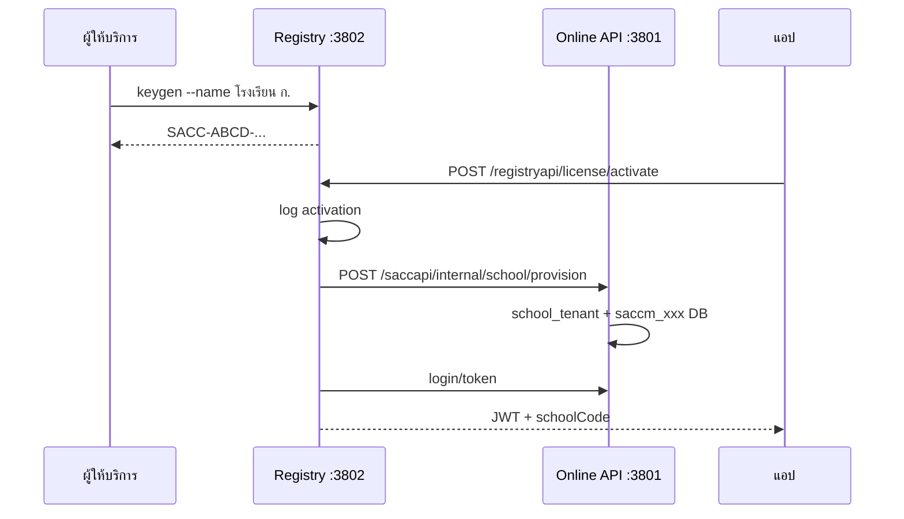

# ออกแบบระบบ Keygen / License (SACCM)

## แยก 3 ชั้น

| ชั้น | ที่อยู่ | หน้าที่ |
|------|---------|---------|
| **ทดลองใช้บนเครื่อง** | `forntend/lib/features/license/embedded_trial_license.dart` | `kEmbeddedTrialDays = 90` — วันแรกไม่ต้องลงทะเบียน |
| **Registry** | `registry-backend/` | รหัส SACC มาตรฐาน, keygen, log, เครื่อง |
| **Online API** | `backend/` | ข้อมูลการเงิน, sync — **ไม่มี** license |

## โมเดลข้อมูล Registry (`saccm_registry`)

| ตาราง | หน้าที่ |
|--------|---------|
| `school_license` | hash รหัส, สถานะ, trial/standard, วันหมดอายุ |
| `school_device` | เครื่องที่ activate |
| `license_issue_log` | บันทึกตอน keygen |
| `license_activation_log` | activate / fail / heartbeat |

## โมเดล Online API (`backend`)

| ตาราง | หน้าที่ |
|--------|---------|
| `school_tenant` | แมป `school_code` → `db_name` (สร้างจาก Registry ตอน provision) |

ไม่เก็บรหัส license, ไม่เก็บรายการเครื่อง

## รหัสเปิดใช้งาน

```
SACC-XXXX-XXXX-XXXX
```

- ทดลองใช้: **90 วัน** ในแอป (`kEmbeddedTrialDays`) — ไม่ผ่าน Registry
- รหัสมาตรฐาน: 365 วัน default จาก Registry

## Flow



## คำสั่ง

```bash
cd registry-backend
npm run keygen:offline -- --name "โรงเรียนบ้านตัวอย่าง"
npm run keygen:online -- --name "โรงเรียน ก." --days 365
# Windows/npm fallback: school name can be positional if --name is stripped by the shell/npm layer.
npm run keygen:offline -- "โรงเรียนบ้านตัวอย่าง"
```

```powershell
cd release\scripts
.\keygen.ps1 -SchoolName "โรงเรียน ก."
```

## API Registry

- `POST /registryapi/license/activate`
- `POST /registryapi/license/status`
- `POST /registryapi/license/heartbeat`
- `POST /registryapi/license/admin/generate`
- `GET /registryapi/license/admin/issue-logs`
- `GET /registryapi/license/admin/activation-logs`

## Online API (ไม่มี /license)

- `POST /saccapi/internal/school/provision` — Registry เท่านั้น (`X-Internal-Secret`)
- `POST /saccapi/login/token` — ต้องมี `schoolCode`
